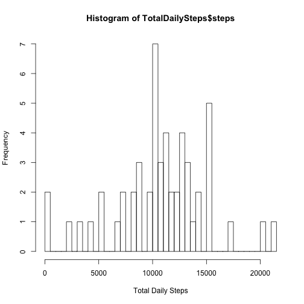
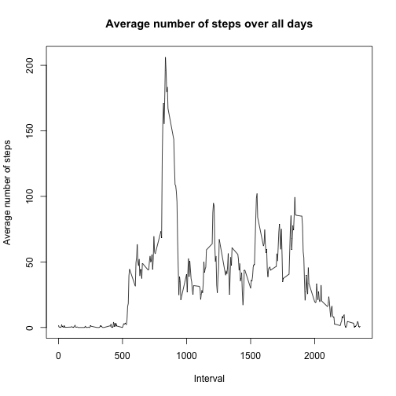
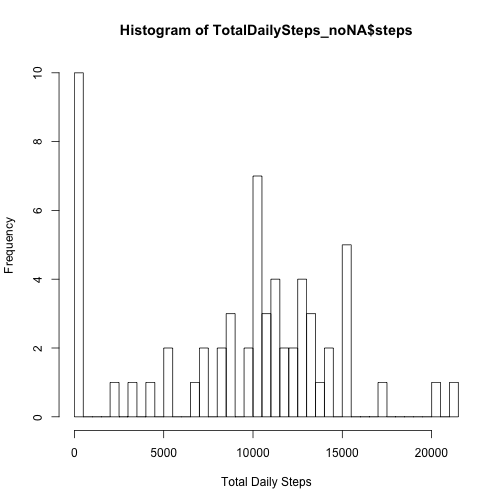
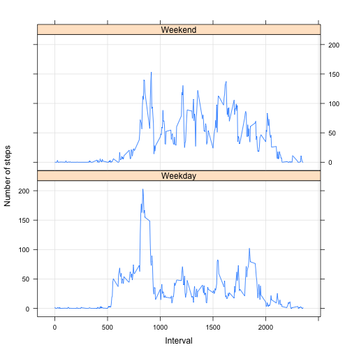

LOADING AND READING THE DATA
============================


```r
# set the working directory
setwd("/Volumes/AnnePortable2T/A_Daily_sync_work_home/DataScience/Coursera/DataScienceSpecialisation/Course5_ReproducibleResearch/Week2/Assignment")


# read in predownloaded data
data <- read.csv("activity.csv", header = TRUE)
head(data)
```

```
##   steps       date interval
## 1    NA 2012-10-01        0
## 2    NA 2012-10-01        5
## 3    NA 2012-10-01       10
## 4    NA 2012-10-01       15
## 5    NA 2012-10-01       20
## 6    NA 2012-10-01       25
```


MEAN TOTAL NO. OF DAILY STEPS
=============================
NB: Missing values are ignored here.

Q1. Calculate the total number of steps taken per day
----------------------------------------------------


```r
TotalDailySteps <- aggregate(steps ~ date, data = data, sum, na.rm = TRUE)
TotalDailySteps
```

```
##          date steps
## 1  2012-10-02   126
## 2  2012-10-03 11352
## 3  2012-10-04 12116
## 4  2012-10-05 13294
## 5  2012-10-06 15420
## 6  2012-10-07 11015
## 7  2012-10-09 12811
## 8  2012-10-10  9900
## 9  2012-10-11 10304
## 10 2012-10-12 17382
## 11 2012-10-13 12426
## 12 2012-10-14 15098
## 13 2012-10-15 10139
## 14 2012-10-16 15084
## 15 2012-10-17 13452
## 16 2012-10-18 10056
## 17 2012-10-19 11829
## 18 2012-10-20 10395
## 19 2012-10-21  8821
## 20 2012-10-22 13460
## 21 2012-10-23  8918
## 22 2012-10-24  8355
## 23 2012-10-25  2492
## 24 2012-10-26  6778
## 25 2012-10-27 10119
## 26 2012-10-28 11458
## 27 2012-10-29  5018
## 28 2012-10-30  9819
## 29 2012-10-31 15414
## 30 2012-11-02 10600
## 31 2012-11-03 10571
## 32 2012-11-05 10439
## 33 2012-11-06  8334
## 34 2012-11-07 12883
## 35 2012-11-08  3219
## 36 2012-11-11 12608
## 37 2012-11-12 10765
## 38 2012-11-13  7336
## 39 2012-11-15    41
## 40 2012-11-16  5441
## 41 2012-11-17 14339
## 42 2012-11-18 15110
## 43 2012-11-19  8841
## 44 2012-11-20  4472
## 45 2012-11-21 12787
## 46 2012-11-22 20427
## 47 2012-11-23 21194
## 48 2012-11-24 14478
## 49 2012-11-25 11834
## 50 2012-11-26 11162
## 51 2012-11-27 13646
## 52 2012-11-28 10183
## 53 2012-11-29  7047
```

Q2. Make a histogram of the total daily steps
---------------------------------------------


```r
hist(TotalDailySteps$steps, breaks = 40, xlab = "Total Daily Steps")
```



Q3. Calculate and report the mean and median of the total number of steps taken per day
-------------------------------------------------------------------------------------


```r
summary(TotalDailySteps)
```

```
##          date        steps      
##  2012-10-02: 1   Min.   :   41  
##  2012-10-03: 1   1st Qu.: 8841  
##  2012-10-04: 1   Median :10765  
##  2012-10-05: 1   Mean   :10766  
##  2012-10-06: 1   3rd Qu.:13294  
##  2012-10-07: 1   Max.   :21194  
##  (Other)   :47
```

The mean of Total Daily steps = 10766 and the median = 10765


AVERAGE DAILY ACTIVITY PATTERN
==============================
Q1. Make a time series plot (i.e. type = "l") of the 5-minute interval (x-axis) and the average number of steps taken, averaged across all days (y-axis)
----------------------------------------


```r
# data for the plot
steps_by_interval <- aggregate(steps ~ interval, data, mean)

# the time series plot 
plot(steps_by_interval$steps ~ steps_by_interval$interval, type = "l", 
     main = "Average number of steps over all days", xlab = "Interval", 
     ylab = "Average number of steps")
```




Q2. Which 5-minute interval, on average across all the days in the dataset, contains the maximum number of steps?
---------------------------------------


```r
row_max_steps <- which.max(steps_by_interval$steps)
steps_by_interval[row_max_steps, ]
```

```
##     interval    steps
## 104      835 206.1698
```

The interval with the maximum number of steps is 835


IMPUTING MISSING VALUES
=======================
Note that there are a number of days/intervals where there are missing values (coded as NA). The presence of missing days may introduce bias into some calculations or summaries of the data.

Q1. Calculate and report the total number of missing values in the dataset (i.e. the total number of rows with NAs)
---------------------------------------


```r
sum(is.na(data))
```

```
## [1] 2304
```

The total number of rows with NAs is 2304


Q2. Devise a strategy for filling in all of the missing values in the dataset. The strategy does not need to be sophisticated. For example, you could use the mean/median for that day, or the mean for that 5-minute interval, etc.
---------------------------------------

I've replaced all the NAs with 0's:


```r
data_nareplace <- data
data_nareplace[is.na(data_nareplace)] <- 0
```

Q3. Create a new dataset that is equal to the original dataset but with the missing data filled in.
---------------------------------------
This is the dataset created above:


```r
head(data_nareplace)
```

```
##   steps       date interval
## 1     0 2012-10-01        0
## 2     0 2012-10-01        5
## 3     0 2012-10-01       10
## 4     0 2012-10-01       15
## 5     0 2012-10-01       20
## 6     0 2012-10-01       25
```


Q4. Make a histogram of the total number of steps taken each day and Calculate and report the mean and median total number of steps taken per day. Do these values differ from the estimates from the first part of the assignment? What is the impact of imputing missing data on the estimates of the total daily number of steps?
---------------------------------------


```r
# Calculate the total number of steps taken per day

TotalDailySteps_noNA <- aggregate(steps ~ date, data = data_nareplace, sum)
head(TotalDailySteps_noNA)
```

```
##         date steps
## 1 2012-10-01     0
## 2 2012-10-02   126
## 3 2012-10-03 11352
## 4 2012-10-04 12116
## 5 2012-10-05 13294
## 6 2012-10-06 15420
```


```r
# Make a histogram of the total daily steps

hist(TotalDailySteps_noNA$steps, breaks = 40, xlab = "Total Daily Steps")
```




```r
# to find mean and median of TotalDailySteps_noNA

summary(TotalDailySteps_noNA)
```

```
##          date        steps      
##  2012-10-01: 1   Min.   :    0  
##  2012-10-02: 1   1st Qu.: 6778  
##  2012-10-03: 1   Median :10395  
##  2012-10-04: 1   Mean   : 9354  
##  2012-10-05: 1   3rd Qu.:12811  
##  2012-10-06: 1   Max.   :21194  
##  (Other)   :55
```

For the imputed dataset with NAs replaced, the mean = 9354 and median = 10395.
These values do differ from the original dataset (where we found a mean of Total Daily steps = 10766 and the median = 10765). As I replaced NAs with 0, the mean decreased, and the difference between the mean and median values increased.


DIFFERENCES IN ACTICITY PATTERNS BETWEEN WEEKDAYS AND WEEKENDS
==============================================================
NOTES: Use the dataset with the filled-in missing values for this part.

Q1. Create a new factor variable in the dataset with two levels ??? weekday and weekend - indicating whether a given date is a weekday or weekend day.
---------------------------------------


```r
# make sure dates are in date format
library(lubridate)
```

```
## 
## Attaching package: 'lubridate'
```

```
## The following object is masked from 'package:base':
## 
##     date
```

```r
date <- ymd(data_nareplace$date)

# add a new columns with day of the week for date
day <- weekdays(date)

# bind into a new data frame
newData <- cbind(data_nareplace, day)

# add a column containining either 'Weekend' or 'Weekday'
newData$DayType <- ifelse(newData$day == "Saturday" | newData$day == "Sunday", "Weekend", "Weekday")
```


Q2. Make a panel plot containing a time series plot (i.e. type = "l") of the 5-minute interval (x-axis) and the average number of steps taken, averaged across all weekday days or weekend days (y-axis). See the README file in the GitHub repository to see an example of what this plot should look like using simulated data.
---------------------------------------


```r
# data for the plot
steps_by_interval_newData <- aggregate(steps ~ interval + DayType, newData, mean)

library(lattice)
xyplot(steps ~ interval | DayType, data = steps_by_interval_newData, type = "l", grid=T, layout=c(1,2), ylab = "Number of steps", xlab = "Interval", main = "")
```


